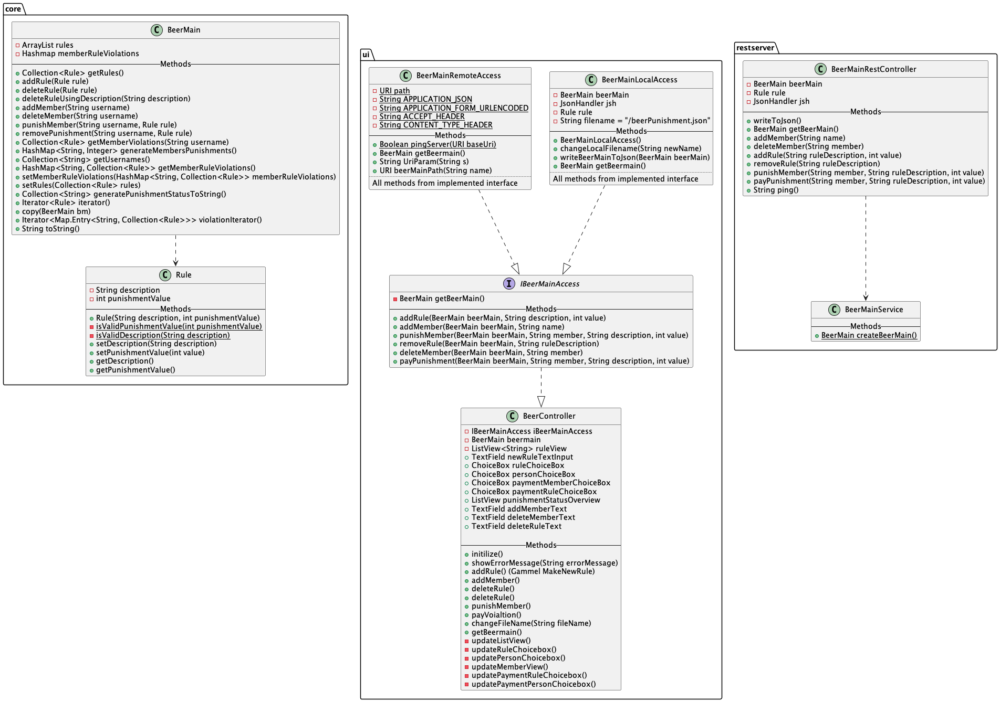

# Beer Punishment
### :nerd_face:  Motivation and purpose for the project :nerd_face: 
Group projects has a history of being a struggle. Working in teams can be found difficult, and therefore a set of rules is often created to secure a good experience. 
However, rules are often broken and punishments in forms of beers is assigned. 
The purpose of this application is to be a platform that has an overview of the rules to follow, and where punishments are tracked.
The group felt that this was something that was missing, and therefore decided to take manners into own hands. 

### Userstories

##### Release 1
This release contains one user stories:

*User story 1:*
>A member of the group wants to keep track of the rules which leeds to punishment.

<ins>Able to see:</ins> An overview of registered rules

<ins>Able to do:</ins> Add new rule in a txt-file.

Read more about it here: [Release 1](./docs/release1/release1.md)

##### Release 2
In this release the group will continue to add more functionality. The goal is to implement most of the wanted logic.

*User story 2:*
>A group wants one person´s late comings to be punished.

*User story 3:*
>The group wants to display a list with the group members and how many penalties each member has.

<ins>Able to see:</ins> An overview of registered rules, An overview of members with belonging penalties

<ins>Able to do:</ins> Register a new member, register a new rule, punish a member

Read more about it here: [Release 2](./docs/release2/release2.md)

##### :Release 3
This is the final release, where all the intended logic is to be implemented.

*User story 4:*
> Anna wants to punish Sara for one of her several rule violation. She unfortunately gets Sara´s name entered incorrectly in the application, and wants to remove this new member from the app. She therefore wants to create a function to delete this name,
so that only desired members are displayed on the application.

*User story 5:*
> The group has decided that phone use no longer should be punished, as it has proven to not be particularly problematic. They therefore want to have the option to remove existing rules in the application,
so that they can delete the rule of no phone use.

*User story 6:*
> Over the course of several months, Maurice has been punished with various beer penalties, and is starting to get loads of beers he has to pay for. To make sure that the amount does not get too large towards the end of the year, he wants to pay down his debt. Maurice wants to delete
his existing rule breaks in the app after paying them up.

<ins>Able to see:</ins> An overview of registered rules, an overview of members with belonging penalties

<ins>Able to do:</ins> Register a new member, register a new rule, punish a member, remove a member, remove a rule, pay a punishment

Read more about it here: [Release 3](./docs/release3/release3.md)

### Functionality at final release:

#### What we can see
* Overview of how many beer penalties individuals have.
* Rules regarding violations that provide penalties.

#### Functionality

:round_pushpin: Create a new rule
  * Description of rule.
  * Punishment value; amount of beers.

:round_pushpin: Add new member

:round_pushpin: Register a new rule violation
  * The rule broken - included description of rule and value of punishment.
  * The member who broke the rule.

:round_pushpin: Delete-functionality 
  * Delete members.
  * Delete rules, using only description.
  * Delete punishments by paying up for rules broken.

###  Project Structure

#### Class diagram

#### Package diagram - Local Access

#### Package diagram - Remote Access

#### Sequence diagram

