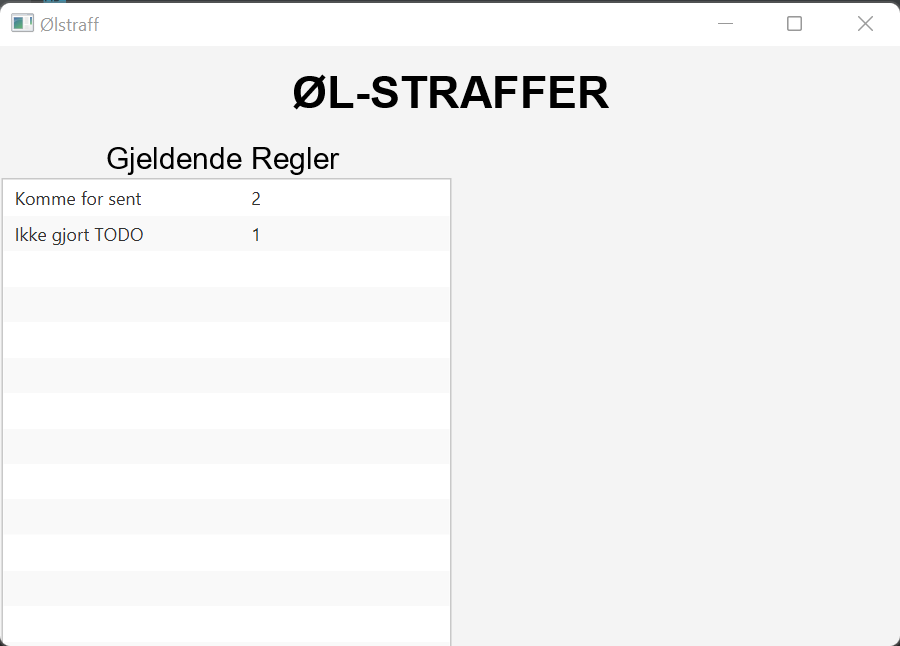

# Documentation for release 1 - gr2231
## For release one the project consists of the following classes and resources:

### Beer_punishment
* BeerApp.java
* BeerController.java
* BeerMain.java
* FileHandler.java
* Rule.java

### At release 1 the app will consist of this scene

### Intended functionality for release 1:
* We have created a beer punishment system that will keep an overview of rules and corresponding penalties for breaking them.
* We have implemented functionality to be able to read from a file. In our case, the file is  an overview of which rules apply and corresponding penalties for breaking them.
* We have implemented the logic to be able to write and read new rules to a file, but have not implemented the controller logic for this.

### User story for release 1
> 
