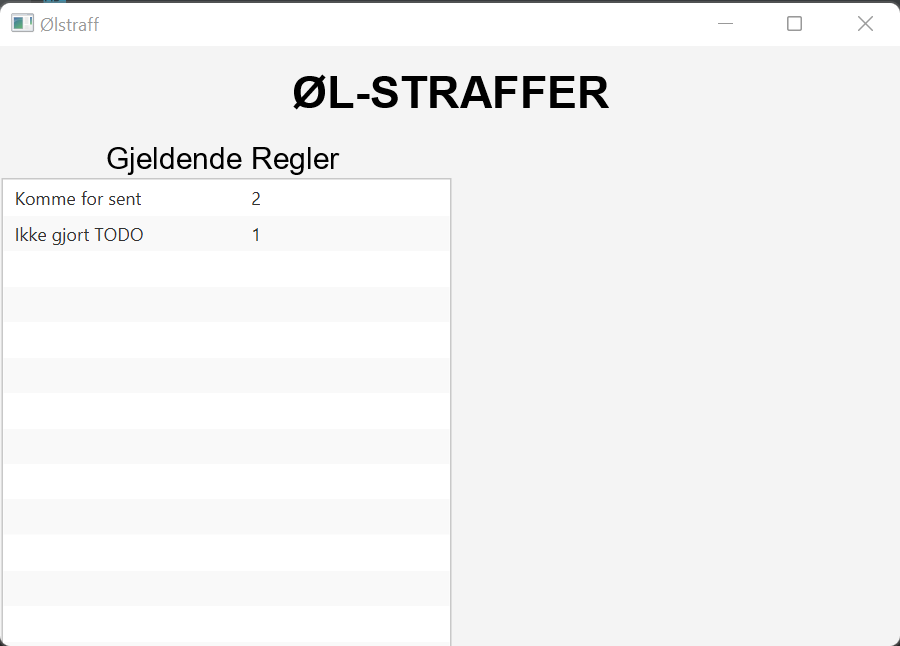

# Documentation for release 1 - gr2231

### Introduction
For release 1 the group started by discussing what kind of app the group wanted to make, and chose to make something the group all found useful
in our lives. The application is called "Beer Punishment" and the motivation and purpose is described in the
[source-readme](../../beer_punishment/README.md). The group have built the foundation of the project with two domain-logic classes, a filehandler,
a controller-class and an app-class. The project has its code repository on git.

### Working habits and task management:
The group used issues in Git to divide the different parts of the release requirements into issues, and assigned them to the various group members. 
Gradually the group understood that it was better to work in pairs, and that this was more efficient than sitting alone.
It was somewhat difficult to know in which order the group should solve the issues. It took a lot of time and work to 
understand the pom-file and how to add the maven-dependency.

### For release one the project consists of the following classes:

#### Beer_punishment
* BeerApp.java
* BeerController.java
* BeerMain.java
* FileHandler.java
* Rule.java

### Functionality for release 1:
* The group have created a beer punishment system that will keep an overview of rules with a corresponding value representing the number of beers one gets when breaking the rule.
* The group have implemented functionality to be able to read from a file. In our case, the file is  an overview of which rules apply and corresponding penalties for breaking them.
* The group have implemented the logic to be able to write and read new rules to a file, but have not implemented the controller logic for this.

### Userstory:
The userstories are described in the [source readme](../../readme.md). The new functionality for this release will fulfil the needed functionality for userstory 1.

### At release 1 the app consists of this scene

