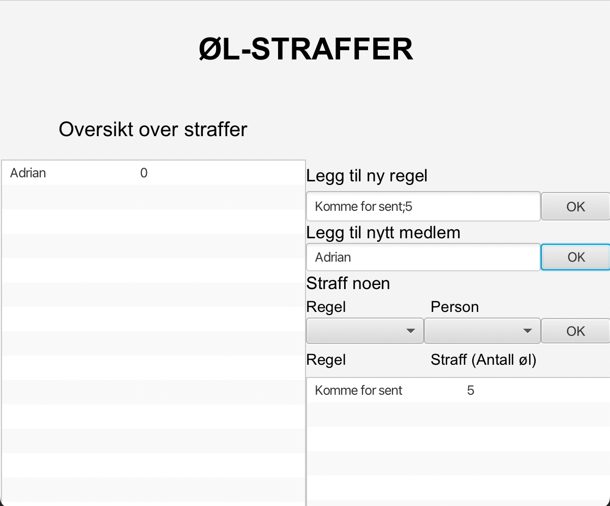

# Documentation for release 2 - gr2231

### Introduction
For release 2 the group has divided the project into different modules with dependencies.
We have built a three-layer architecture with core-logic, json-logic and ui divided.
We use JSON file format to save the user data.

### Working habits and task management:
The group has mainly used pair-programming which has been effective.
We started with splitting the group in two pairs, and assigned issues to each of the pairs.
As we got further into the programming, we encountered a number of problems related to misunderstanding of communication.
Therefore, the two pairs were so into the coding and worked on two separate branches, without having control of the other pairs work.
We realised along the way that we needed to communicate better, and each other when problems occur.

For the next sprint we will work on how we can better the communication through introducing the SCRUM standups in every meeting.
This will make it easier for each member to have better control of what the other group members are working on, and will hopefully result in a more agile development.

The group have been striving towards having two group meeting a week, which has been working well.
We have worked on having more specific issues, and it is easier to have an overview on what needs to be done before the next release.

### Methods for qulity ensurance of code:
We intend to implement tests for all the modules, and used JaCoCo plugin to get test reports in order to check our test coverage.
We have also implemented Checkstyle and Spotbugs to check the code quality.

### For release two the project consists of the following classes and resources:

#### Core
* BeerMain.java
* Rule.java

#### Json
* \+ BeerMainDeserializer.java
* \+ BeerMainSerializer.java
* \+ RuleDeserializer.java
* \+ RuleSerializer.java
* \+ RulePersistence.java
* \+ RuleModule.java

#### UI
* BeerApp.java
* BeerController.java
   
  ##### Resources:
    * Beer.fxml

#### At release 2 the app will consist of this scene

 Note &rarr; The rule needs to be written in the format "Rule description;punishment value". An example is shown in the picture below.

### User story for release 2:
User Story 3 
>Now that the group has a set of rules to follow, Sara wants to punish Maurice and give him the penalties he deserves.
She wants to display a list of the group members and how many penalties each member has.