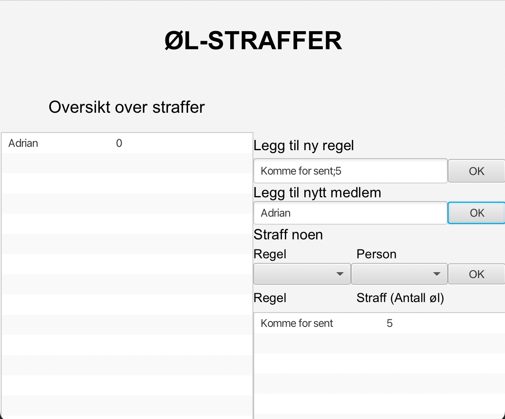

# Documentation for release 2 - gr2231

### Introduction
For release 2 the group has divided the project into different modules with dependencies.
We have built a three-layer architecture with core-logic, json-logic and ui divided.
We use JSON file format to save the user data.

### Working habits and task management:
The group has mainly used pair-programming which has been effective.
The group started with splitting in two, and assigned issues to a member of each pair.
As the group got further into the programming, a number of problems related to misunderstanding of communication encountered.
The two pairs did not have overview over the other pairs work, which led to merge conflicts and misunderstandings.
The group realised that daily stand-ups were important, and something that should be implemented.
Therefore, for the next sprint the group will work on how to better the communication through introducing the SCRUM stand-ups in every meeting.
This will make it easier for each member to have better control of what the other group members are working on, and will hopefully result in a more agile development.

The group has been striving towards having two group meeting a week, which has been working well.
The group have worked on having more specific issues, to easier have an overview over problems remaining.

### Methods for quality ensurance of code:
The group intend to implement tests for all the modules, and used Jacoco for ensuring testing coverage above 90%.
A high test coverage have been an important task for the group, due to making sure that each method works the way it was intended to.
To secure a better code quality the *CheckStyle* and *SpotBugs* plugin were implemented.
*Checkstyle* had a large impact of the groups overall code standard, and *SpotBugs* is implemented in order for the group 
to be aware of bugs in the code. 

### Storage
The group have discussed and reflected on the use of *document metaphor* versus *implicit 
storage*. 
After release 2 the project uses *implicit storage*, because the user of BeerPunishment does not have a
'store' button. 
The group decided to use *implicit storage* because the group felt it hands out a more agile user experience. 

### For release 2 the project consists of the following classes and resources:

#### Core
* BeerMain.java
* Rule.java

#### Json
* BeerMainDeserializer.java
* BeerMainSerializer.java
* RuleDeserializer.java
* RuleSerializer.java
* RulePersistence.java
* RuleModule.java

#### UI
* BeerApp.java
* BeerController.java
   
  ##### Resources:
    * Beer.fxml

#### At release 2 the app will consist of this scene

### User story for release 2:
User Story 3 
>Now that the group has a set of rules to follow, Sara can finally punish Maurice and give him the penalties he deserves.
She wants to display a list with the group members and how many penalties each member has.