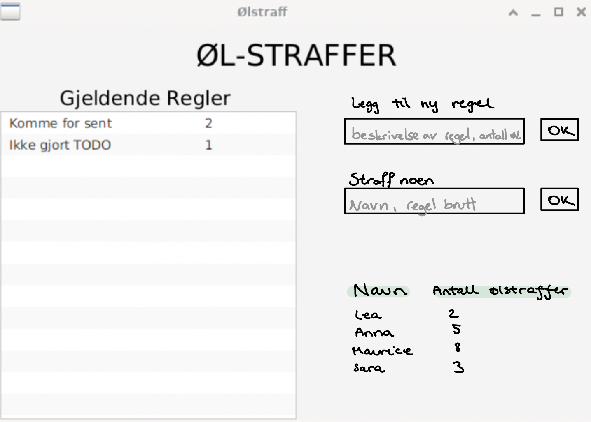

Dette prosjektet er besvarelsen til gruppe 31 i faget ITP1901.

# Beer Punishment
This repo contains a multi-package, multi-module javafx project for a beer punishment system. This application is primarily meant for people who work in teams or groups.
This app will provide a clear overview of what rules applies to the group/team, who has broken which rules and how many beers each individual has as punishment.
You can read more about the project here LINKTODO.

### Building and running the project
Note:
This project is built up with maven, and if maven is not installed you can use gitpod.

#### Runnning application with local access:
1. Navigate to beer_punishment directory
2. Install dependencies and run test
3. Navigate to ui directory
4. mvn javafx:run

### Organization of the code
* [beer_punishment](README.md)
    * [core](/core)

# Bilde av tenkt UI
